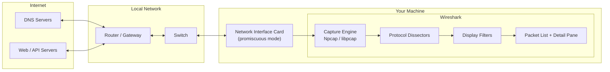

# Network Traffic Analysis with Wireshark

Hands-on packet analysis lab demonstrating live capture, display filtering, TCP
connection analysis, and stream reconstruction using Wireshark. This repository
contains three annotated packet captures and a breakdown of what each one shows
and why it matters for network and security work.

**Tools:** Wireshark (free, open source) · tshark · nslookup
**Skill areas:** Network analysis · DNS troubleshooting · TCP/IP · Traffic inspection
**Certification alignment:** CompTIA Network+ · Security+ · CySA+

---

## The business problem this solves

Every login, transaction, and support ticket your organization touches
eventually comes down to traffic moving across a network. When that traffic
breaks — a customer can't reach your site, a critical service alert fires, a
security incident is suspected — the business needs an answer fast, and
answers built on guesswork are expensive. A misdiagnosed outage burns
engineering hours; a missed indicator of compromise turns into a breach
disclosure.

Logs and dashboards summarize what a system *thinks* happened. A packet
capture shows what actually happened on the wire, unfiltered — no
interpretation layer in between. This lab
demonstrates the ability to read that traffic directly and answer, with
evidence, whether an outage is client-side or
server-side, whether a connection was refused or simply never arrived, and
whether sensitive data was ever exposed in the clear. That's the skill a Help
Desk, Network Engineer, or SOC Analyst is actually hired to bring to an
incident: faster, correct root-causing instead of trial-and-error.

It also scales into the environment most organizations run in today. The same
reasoning used here to read raw packets is what's needed to interpret Azure
Network Watcher captures or VPC flow logs in the cloud — so this isn't a
skill confined to on-prem troubleshooting, it's the foundation for cloud
network and security work as well.

---

## Architecture — How Wireshark captures traffic

Traffic flows from external hosts on the internet, through the local network,
and into the machine running Wireshark. Wireshark doesn't sit "on the network"
— it taps a specific network interface, and Npcap/libpcap hands every frame that
crosses that interface up to the capture engine, where dissectors decode each
protocol layer and display filters narrow down what you actually look at.



**Reading the flow:**

1. External hosts (DNS servers, web/API servers) exchange traffic with your
   network through the **router/gateway**.
2. The **switch** forwards frames within the local segment. On a switched
   network your interface normally sees its own traffic plus broadcasts; a hub
   or a configured mirror/SPAN port is what lets you see other hosts' traffic.
3. Your **NIC in promiscuous mode** accepts every frame it sees rather than only
   those addressed to it.
4. **Npcap/libpcap** hands those frames to Wireshark's **capture engine**.
5. **Dissectors** decode each layer — Ethernet, IP, TCP, then the application
   protocol — and **display filters** reduce millions of packets to the handful
   that matter, shown in the **packet list and detail pane**.

> This diagram renders automatically on GitHub — it's [Mermaid](https://mermaid.js.org/)
> code, not an image, so it lives in version control and stays editable.

---

## What's in this repository

| File | What it captures | Key concept demonstrated |
|------|------------------|--------------------------|
| `dns-lookup.pcapng` | A DNS query and its response for a domain | How name resolution works before every connection |
| `tcp-handshake.pcapng` | A full TCP three-way handshake | How connections are established (SYN → SYN-ACK → ACK) |
| `tcp-stream.pcapng` | A reconstructed HTTP conversation | How individual packets reassemble into a readable exchange |

---

## Capture 1 — DNS Lookup

**File:** `dns-lookup.pcapng`
**Filter used:** `dns`

### What it shows

This capture records a DNS resolution triggered manually with
`nslookup google.com`. Two packets tell the story:

- **The query** — my machine asking a DNS server "what is the IPv4 address
  (A record) for this domain?"
- **The response** — the DNS server answering with one or more IP addresses in
  the Answers section of the packet.

The query and response share a matching transaction ID, which is how you pair a
request with its answer in a busy capture.

### Steps to reproduce

1. Open Wireshark and select your active interface (Ethernet or Wi-Fi — pick
   the one showing live activity in the wave graph).
2. Click the blue shark-fin icon to start capturing. Leave Wireshark running.
3. Open a separate terminal window — Wireshark has no terminal of its own, so
   this has to be a second application:
   - **Windows:** press the Windows key, type `cmd`, press Enter.
   - **macOS:** press `Cmd + Space`, type `Terminal`, press Enter.
   - **Linux:** `Ctrl + Alt + T`, or right-click the desktop → Open Terminal.
4. In the terminal, run:
   ```bash
   nslookup google.com
   ```
5. Note the IP address(es) the terminal returns — you'll use this to verify
   the capture in step 8.
6. Switch back to Wireshark and click the red square **Stop** button.
7. In the display filter bar, type `dns` and press Enter.
8. Find the query packet — Info column reads `Standard query A google.com` —
   and the matching response — `Standard query response A google.com`.
9. Click the response packet, then expand **Domain Name System (response)** in
   the detail pane and open the **Answers** section. Confirm the IP address
   shown here matches what the terminal returned in step 5.
10. Save the result: `File → Export Specified Packets → Displayed`, and save
    as `dns-lookup.pcapng`.

### What I learned

DNS runs invisibly before nearly every network action — web requests, API
calls, email delivery. If DNS fails, everything downstream fails, even when the
rest of the network is perfectly healthy. That makes name resolution one of the
first things to check when "nothing works."

From a security angle, unexpected DNS queries — lookups to unusual or
algorithmically generated domains — are frequently the first observable sign of
malware beaconing out to a command-and-control server. Learning to spot normal
DNS makes abnormal DNS stand out.

---

## Capture 2 — TCP Three-Way Handshake

**File:** `tcp-handshake.pcapng`
**Filter used:** `tcp and ip.addr == <server IP>`

### What it shows

Before any data moves over TCP, two hosts negotiate a connection in three
steps. This capture shows all three in order:

| Packet | Flags | Meaning |
|--------|-------|---------|
| 1 | `SYN` | Client: "I want to connect. Here's my sequence number." |
| 2 | `SYN, ACK` | Server: "Got it. Here's mine. Connection accepted." |
| 3 | `ACK` | Client: "Confirmed. Connection is open." |

### Steps to reproduce

1. Open a terminal and run `nslookup example.com` to get the destination IP
   address ahead of time — you'll need it for the filter in step 5.
2. In Wireshark, start a capture on your active interface.
3. Open a browser and navigate to **`http://example.com`** — use HTTP, not
   HTTPS. Plain HTTP makes the handshake easier to isolate since there's no TLS
   negotiation layered on top.
4. Stop the capture.
5. Apply the filter:
   ```
   tcp and ip.addr == <IP from step 1>
   ```
6. Look at the Info column for the first few packets in the filtered list and
   find three in sequence with these flags: `SYN` → `SYN, ACK` → `ACK`.
7. Click each packet and confirm the flags in the packet detail pane under
   **Transmission Control Protocol → Flags**.
8. Save the result: `File → Export Specified Packets → Displayed`, and save
   as `tcp-handshake.pcapng`.

**Troubleshooting tip:** if you don't see a clean SYN → SYN-ACK → ACK sequence,
check whether your browser upgraded the connection to HTTPS automatically —
some browsers force this. Try a different HTTP-only test site if `example.com`
redirects.

### What I learned

The handshake is a fast, reliable diagnostic. A **complete** SYN → SYN-ACK → ACK
sequence means the connection succeeded at the transport layer. The two failure
patterns are just as informative:

- **SYN with no SYN-ACK** — the connection was never accepted. The server is
  unreachable, a firewall is dropping the traffic, or nothing is listening on
  that port.
- **RST (reset)** — the connection was actively refused or forcibly torn down.

Being able to read these three packets tells you *immediately* whether a
connectivity problem is client-side, network-side, or server-side — without
guessing.

---

## Capture 3 — Follow TCP Stream

**File:** `tcp-stream.pcapng`
**Action used:** Right-click a packet → Follow → TCP Stream

### What it shows

Individual packets are fragments of a larger conversation. This capture uses
Wireshark's stream-following feature to reassemble every packet from a single
TCP connection into one continuous, readable exchange — the client's requests
and the server's responses shown in sequence.

### Steps to reproduce

1. In Wireshark, start a capture on your active interface.
2. Open a browser and navigate to any HTTP (not HTTPS) website.
3. Stop the capture.
4. Apply the filter `http` to narrow the list down to HTTP traffic.
5. Right-click any HTTP packet belonging to that page load, then select
   **Follow → TCP Stream**.
6. Wireshark opens a new window showing the reassembled conversation. Text in
   red is your browser's request; text in blue is the server's response.
7. Read through the exchange — note the HTTP request line, headers, and the
   server's response headers and body.
8. Close the stream window. The display filter bar will now show a
   `tcp.stream eq <n>` filter automatically applied — this isolates just the
   packets belonging to that conversation.
9. Save the result: `File → Export Specified Packets → Displayed`, and save
   as `tcp-stream.pcapng`.

### What I learned

Reading packets one at a time is like reading a conversation one word at a time
out of order. The stream view reconstructs the whole exchange, which is exactly
what incident responders do to understand what actually happened during an
event: what was requested, what data moved, and what the server sent back.

This exercise also reinforced why **HTTPS is non-negotiable**. Over plain HTTP,
the entire conversation — including any credentials submitted in a form — is
visible in cleartext to anyone on the network path. TLS encryption is what turns
that readable stream into unreadable ciphertext.

---

## Useful display filters

| Filter | Shows |
|--------|-------|
| `dns` | DNS queries and responses |
| `tcp` | All TCP traffic |
| `tcp.flags.syn == 1` | Connection attempts |
| `tcp.flags.reset == 1` | Refused or reset connections |
| `http.request` | HTTP GET/POST requests |
| `ip.addr == <IP>` | All traffic to or from a specific host |
| `tcp.port == 443` | HTTPS traffic by port |

---

## Ethics note

All captures in this repository were taken on systems and networks I own or had
explicit permission to analyse. Packet capture on networks you do not own or are
not authorised to monitor is illegal in most jurisdictions. Capture responsibly.

---

## Key takeaways

- DNS resolution precedes almost every network action — and broken DNS looks
  like everything being broken.
- A TCP handshake is a three-packet diagnostic that isolates connectivity
  problems fast.
- Cleartext protocols expose everything on the wire; encryption is what makes
  captured traffic unreadable.
- The mental model built here — reading traffic at the packet level — transfers
  directly to cloud network troubleshooting and SOC investigation work.
